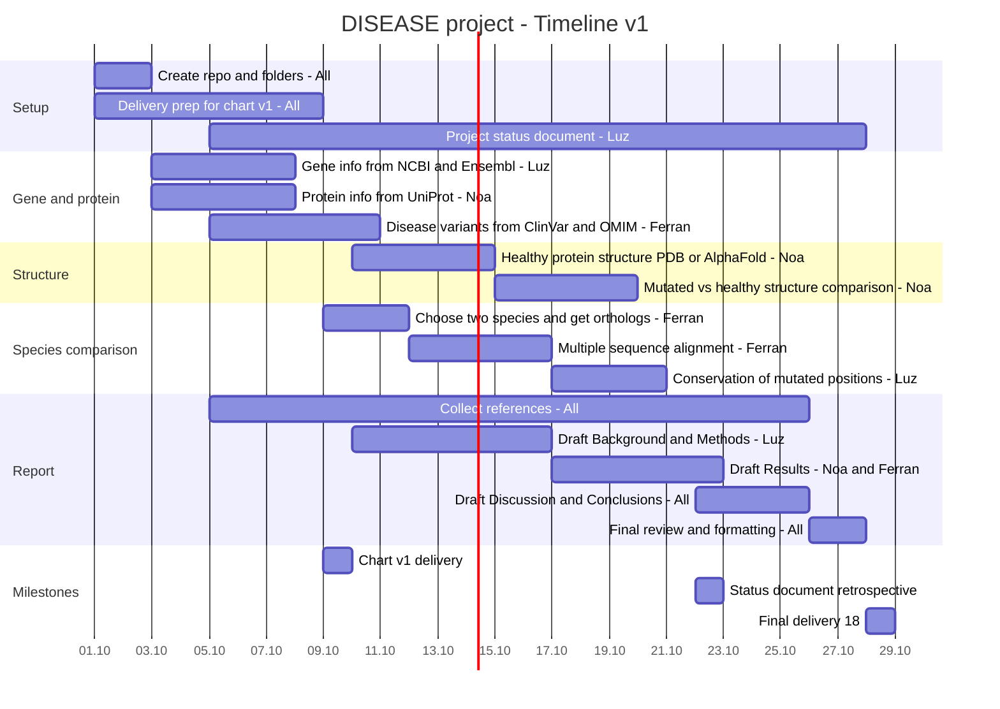

# Timeline v1 (frozen 09.10)

```mermaid
gantt
    title DISEASE project - Timeline v1
    dateFormat YYYY-MM-DD
    axisFormat %d.%m

    section Setup
    Create repo and folders - All                      :s1, 2026-10-01, 2d
    Delivery prep for chart v1 - All                   :s2, 2026-10-01, 2026-10-09
    Project status document - Luz                      :s3, 2026-10-05, 2026-10-28

    section Gene and protein
    Gene info from NCBI and Ensembl - Luz              :g1, 2026-10-03, 5d
    Protein info from UniProt - Noa                    :g2, 2026-10-03, 5d
    Disease variants from ClinVar and OMIM - Ferran    :g3, 2026-10-05, 6d

    section Structure
    Healthy protein structure PDB or AlphaFold - Noa   :t1, 2026-10-10, 5d
    Mutated vs healthy structure comparison - Noa      :t2, 2026-10-15, 5d

    section Species comparison
    Choose two species and get orthologs - Ferran      :c1, 2026-10-09, 3d
    Multiple sequence alignment - Ferran               :c2, 2026-10-12, 5d
    Conservation of mutated positions - Luz            :c3, 2026-10-17, 4d

    section Report
    Collect references - All                           :r0, 2026-10-05, 2026-10-26
    Draft Background and Methods - Luz                 :r1, 2026-10-10, 7d
    Draft Results - Noa and Ferran                     :r2, 2026-10-17, 6d
    Draft Discussion and Conclusions - All             :r3, 2026-10-22, 4d
    Final review and formatting - All                  :r4, 2026-10-26, 2026-10-28

    section Milestones
    Chart v1 delivery                                  :m1, 2026-10-09, 1d
    Status document retrospective                      :m2, 2026-10-22, 1d
    Final delivery 18:00                               :m3, 2026-10-28, 1d
```
